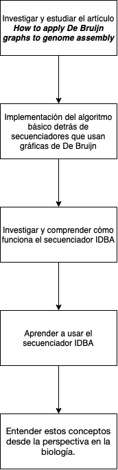

# Ensambladores y Gráficas de De Bruijn
## Facultad de Ciencias - UNAM
### Semestre 2022-1

Proyecto final del equipo 1 de [Genómica computacional - Grupo 7099]( https://www.fciencias.unam.mx/docencia/horarios/presentacion/327603 )

## Pre-requisitos :clipboard:

Para poder dibujar las digráficas de De Bruijn es necesario Python 3.6+ y tener el instalado:

- *graphviz*:\
```pip install graphviz```

## Ejecutar el programa :file_folder:

Para poder utilizar el programa de forma interactica basta correr el script con la bandera *-i*:

```
> python -i DeBruijn.py
```

En otro caso simplemente correr
```
> python DeBruijn.py
```

## Introducción

La teoría de gráficas ha sido extremadamente útil para modelar y resolver problemas de la vida real. En especial, existe una clase de gráficas que son muy especial: las gráficas de De Bruijn.

Una gráfica es un conjunto finito no vacío, al que llamamos el conjunto de vértices, y un conjunto de lineas que unen dichos vértices, a las que llamamos aristas.

El matemático holandés Nicolaas de Bruijn para encontrar una secuencia cíclica de letras tomadas de un alfabeto dado para el cual cada palabra posible de cierta longitud de tamaño k aparece como una subcadena de caracteres consecutivos en la secuencia cíclica exactamente una vez utilizó gráficas, las cuáles son llamadas De Debruijn en su nombre. Para esto, se basó en la idea original de Euler y su respuesta al problema de los puentes de Konigsberg: el paseo euleriano. Un paseo euleriano es aquel que pasa por cada una de las aristas deuna gráfica sin usar más de una vez ninguna arista, si el vértice inicial y final coinciden, le llamamos paseo euleriano cerrado. Aunque este problema parezca ser muy teórico, puede ser usado para resolver una basta cantidad de problemas. En especial, el problema que a nosotros concierne: el ensamblaje del genóma.

Usando gráficas de De Bruijn es posible reconstruir genomas dadas las lecturas que se hagan a una secuencia. Por ejemplo [IDBA](https://github.com/loneknightpy/idba) es ensamblador que usa gráficas de De Bruijn para lecturas de secuenciación.

## Objetivos
- Comprender la base teórica sobre las gráficas de De Bruijn.

- Escrbir un programa que implemente las gráficas de De Bruijn usando el algoritmo básico que estas utilizan.

- Comprender el ensamblador [IDBA](https://github.com/loneknightpy/idba).

- Aprender a usar dicho ensamblador.

## Diagrama Metodológico

<p align="center">
  
</p>

El link si lo quieren editar [aquí](https://drive.google.com/file/d/1is4nNsdQQ7tbTNOh7B3rVVUc1i9vO9cV/view?usp=sharing)


## Perspectivas y aplicaciones en la biología

El estudio de características compartidas por diferentes genomas es fundamental para muchas áreas de la biología, como el análisis pangenómico y la genómica comparativa.

### Comparación de secuencias sin alineamiento

El uso de gráficos de Bruijn es omnipresente en el análisis de secuencias. El ensamblaje del genoma utiliza la propiedad de que las moléculas secuenciadas forman caminos, que se explota en numerosos ensambladores modernos. Por otro lado, la comparación de secuencias sin alineamiento sigue la idea de que secuencias similares comparten k-mers comunes y, por lo tanto, la comparación de gráficos de Bruijn proporciona una buena medida de la similitud de secuencias. Algunos ejemplos de la aplicación de este tipo de metodología son:

#### Llamada de variantes y genotipificado
 Consiste en la identificación de polimorfismos de un solo nucleótido (SNP) y pequeñas inserciones y deleciones (indels) a partir de datos de secuenciación de próxima generación y el establecimiento de la composición génica y alélica de un organismo o grupo de organismos. Permite:
 
 - Predicción de la respuesta de un individuo a ciertos medicamentos
 - Identificación de la susceptibilidad a factores ambientales como las toxinas
 - Predicción del riesgo de desarrollar enfermedades particulares. 
 - Rastreo de la herencia de genes de enfermedades dentro de las familias.
 - Control de la propagación de patógenos rastreando el origen de los brotes.
 
 #### Estimación de la abundancia de transcritos
 Estimar la abundancia relativa de genes que consisten en múltiples transcritos (correspondientes a diferentes isoformas) directamente del número total de lecturas mapeadas al locus del gen. Implica la identificación de cambios estadísticamente significativos en la abundancia relativa de transcritos al comparar diferentes experimentos.

#### Clasificación metagenómica
 En términos simples, consiste en asignar una identidad taxonómica a cada lectura en un conjunto de datos. Debido a que los datos metagenómicos a menudo contienen decenas de millones de lecturas, la clasificación generalmente se realiza mediante la coincidencia exacta de palabras cortas de longitud k (k-mers) en lugar de la alineación, lo que sería inaceptablemente lento.
 
 ### ¿Cuándo usar métodos basados en gráficas de de Bruijn?
A medida que surgen nuevas tecnologías de secuenciación, las mejores estrategias computacionales para ensamblar genomas a partir de lecturas pueden cambiar. La elección de algoritmos dependerá de:

- Cantidad de datos (medidos por la longitud de lectura y la cobertura)
- Calidad de los datos (incluidas las tasas de error)
- Estructura del genoma (como el número y el tamaño de las regiones repetidas y el contenido de GC). 

Las tecnologías de secuenciación de lectura corta producen un gran número de lecturas, lo que actualmente favorece el uso de gráficos de Bruijn. 

Los gráficos de De Bruijn también son adecuados para representar genomas con repeticiones, mientras que los métodos de superposición necesitan enmascarar las repeticiones que son más largas que la longitud de lectura. 

Sin embargo, si una futura tecnología de secuenciación produce lecturas de alta calidad con decenas de miles de bases, se necesitaría un número menor de lecturas y el péndulo podría volver a favorecer los enfoques de ensamblaje basados en la superposición.


## Conclusiones

Se investigó y profundizó sobre teoría de gráficas y sus aplicaciones al ensamblaje de genomas. Se aplicaron los conocimientos de programación adquiridos en el curso para la implementación del algoritmo básico que usan las gráficas de De Bruijn.

## Fuentes y referencias
- Compeau, P. E. C. (2011, 8 noviembre). How to apply de Bruijn graphs to genome assembly. Nature. https://www.nature.com/articles/nbt.2023?error=cookies_not_supported&code=c5e20b2b-ee43-43b0-81e0-4f35d99a74b8

- IDBA-Bioinfomatics Research Group of Hong Kong University. (s. f.). Bioinfomatics Research Group Computer Science, The University of Hong Kong. Recuperado 1 de febrero de 2021, de https://i.cs.hku.hk/%7Ealse/hkubrg/projects/idba/

- Ben Langmead. (2015, 7 mayo). VER LISTA DE REPRODUCCIÓN COMPLETA 55 REPRODUCIENDO Algorithms for DNA Sequencing. Algorithms for DNA Sequencing. Recuperado 1 de febrero de 2022, de https://www.youtube.com/watch?v=hpb-mH-yjLc&list=PL2mpR0RYFQsBiCWVJSvVAO3OJ2t7DzoHA


- Mahadik, K., Wright, C., Kulkarni, M., Bagchi, S. y Chaterji, S. (2019) "Scalable Genome Assembly through Parallel de Bruijn Graph Construction for Multiple k-mers", Scientific Reports. Nature Publishing Group, 9(1), p. 14882. doi:10.1038/s41598-019-51284-9.

- Nagarajan, N. y Pop, M. (2013) "Sequence assembly demystified", Nature Reviews Genetics. Nature Publishing Group, 14(3), pp. 157–167. doi:10.1038/nrg3367.

- Pachter, L. (2011) "Models for transcript quantification from RNA-Seq", arXiv:1104.3889 [q-bio, stat]. Disponible en: http://arxiv.org/abs/1104.3889 (Consultado: el 2 de febrero de 2022).

- Qian, J., Marchiori, D. y Comin, M. (2018) "Fast and Sensitive Classification of Short Metagenomic Reads with SKraken", en Peixoto, N., Silveira, M., Ali, H. H., Maciel, C., y van den Broek, E. L. (eds.) Biomedical Engineering Systems and Technologies. Cham: Springer International Publishing (Communications in Computer and Information Science), pp. 212–226. doi:10.1007/978-3-319-94806-5_12.

- Wood, D. E. y Salzberg, S. L. (2014) "Kraken: ultrafast metagenomic sequence classification using exact alignments", Genome Biology. BioMed Central, 15(3), pp. 1–12. doi:10.1186/gb-2014-15-3-r46.

- Wooley, J. C., Lin, H. S. y Biology, N. R. C. (US) C. on F. at the I. of C. and (2005) Challenge Problems in Bioinformatics and Computational Biology from Other Reports, Catalyzing Inquiry at the Interface of Computing and Biology. National Academies Press (US). Disponible en: http://www.ncbi.nlm.nih.gov/books/NBK25461/ (Consultado: el 1 de febrero de 2022).

- Zhang, W., Chen, J., Yang, Y., Tang, Y., Shang, J. y Shen, B. (2011) "A Practical Comparison of De Novo Genome Assembly Software Tools for Next-Generation Sequencing Technologies", PLOS ONE. Public Library of Science, 6(3), p. e17915. doi:10.1371/journal.pone.0017915.


## Autores :busts_in_silhouette:

-  []() (Marco Cruz Maya)

-  [axelprestegui]( https://github.com/axelprestegui) (K. Axel Prestegui Ramos)

-  [anapaurv]( https://github.com/anapaurv ) (Ana Paula Rubio Vargas)

-  [samuelruizperez]( https://github.com/VianeyAileen ) (Samuel Ruiz Pérez)
